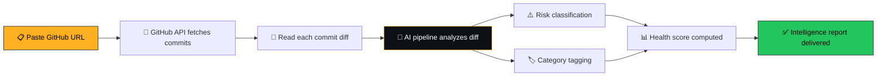

<div align="center">


# GitMind

### Understand any codebase, instantly.

**AI-powered repository intelligence — commit analysis, risk detection, and engineering insight for any public GitHub repo.**

<br/>

[](https://gitmindai.vercel.app)
[](LICENSE)
[](https://nextjs.org)
[](https://fastapi.tiangolo.com)

<br/>


</div>

<br/>

## ✦ What is GitMind?

GitMind reads a GitHub repository the way a senior engineer would — not just the commit messages, but the **actual diffs**. Paste a URL, and within seconds you get plain-English explanations of every commit, a risk classification for each change, and an overall repository health score.

No setup. No OAuth. No configuration. Public repo in, intelligence out.

```
$ paste a github url
$ wait < 30 seconds
$ get a full engineering intelligence report
```

<br/>

## ✦ Live Demo

<div align="center">

**[→ Try GitMind now](https://gitmindai.vercel.app)**

Paste any public repo — `vercel/next.js`, `torvalds/linux`, `microsoft/vscode` — and watch the AI break down its commit history.

</div>

<br/>

## ✦ Features

<table>
<tr>
<td width="50%" valign="top">

### 🧠 Commit Intelligence
Every commit explained in plain English — what changed, why it matters, and what to watch for. No more guessing from a one-line commit message.

### 🛡️ Risk Detection
Classifies every commit as **Safe**, **Warning**, or **High Risk** based on the real diff — security patches, memory leaks, breaking API changes, and more.

### ⚡ Real-Time Streaming
Token-by-token AI analysis streamed live. Results appear as the intelligence engine works — no polling, no waiting screens.

</td>
<td width="50%" valign="top">

### 📊 Repository Health Score
A single quantified score (0–100) derived from commit risk distribution, recent activity, and development velocity signals.

### 🔁 Multi-Model Fallback Chain
Gemini → Groq → OpenRouter. If one provider rate-limits or fails, GitMind silently falls back to the next — zero downtime, zero user-facing errors.

### 🌍 Any Public Repository
Works instantly with any public GitHub repo. No integrations, no tokens, no setup. Just paste a URL.

</td>
</tr>
</table>

<br/>

## ✦ How It Works

<div align="center">



</div>

| Step | What happens |
|------|---------------|
| **01** | You paste any public GitHub URL — no tokens, no OAuth |
| **02** | GitMind fetches the full commit log + diffs via the GitHub REST API |
| **03** | Each diff is sent through the AI pipeline (Gemini → Groq → OpenRouter fallback) |
| **04** | AI returns a plain-English explanation, risk level, and category per commit |
| **05** | A repository health score is computed from the aggregate risk distribution |
| **06** | Full intelligence report renders — in under 30 seconds |

<br/>

## ✦ Tech Stack

<div align="center">

| Layer | Technology |
|-------|------------|
| **Frontend** | Next.js 16 · React · TypeScript · Framer Motion |
| **Backend** | FastAPI · Python 3.11 · ThreadPoolExecutor (parallel analysis) |
| **AI Pipeline** | Google Gemini · Groq (Llama 3.3) · OpenRouter (fallback) |
| **Auth & DB** | Supabase (Postgres + Auth + OAuth) |
| **Hosting** | Vercel (frontend) · Render (backend, Docker) |
| **Source Control API** | GitHub REST API |

</div>

<br/>

## ✦ Architecture

```
┌─────────────────┐      ┌──────────────────┐      ┌─────────────────┐
│   Next.js App    │ ───▶ │   FastAPI Server  │ ───▶ │   GitHub API     │
│   (Vercel)        │      │   (Render/Docker) │      │   (commits/diffs)│
└─────────────────┘      └──────────────────┘      └─────────────────┘
        │                          │
        │                          ▼
        │                ┌──────────────────┐
        │                │   AI Fallback      │
        │                │   Gemini → Groq    │
        │                │   → OpenRouter     │
        │                └──────────────────┘
        ▼
┌─────────────────┐
│    Supabase       │
│  Auth · History    │
│  Saved Repos       │
└─────────────────┘
```

<br/>

## ✦ Risk Classification

GitMind doesn't just read commit messages — it reads the diff itself to classify risk:

<div align="center">

| Level | Color | Triggers |
|-------|-------|----------|
| 🟢 **Safe** | Green | Docs, refactors, test additions, formatting |
| 🟡 **Warning** | Amber | Missing error handling, performance regressions |
| 🔴 **High Risk** | Red | Memory leaks, SQL injection, breaking API changes |

</div>

<br/>

## ✦ Getting Started (Local Development)

```bash
# Clone the repository
git clone https://github.com/ArunChandrasekar07/gitmind.git
cd gitmind
```

### Backend

```bash
cd backend
pip install -r requirements.txt --break-system-packages

# Set environment variables
cp .env.example .env
# Add: GITHUB_TOKEN, GEMINI_API_KEY, GROQ_API_KEY, OPENROUTER_API_KEY

uvicorn app.main:app --reload
```

### Frontend

```bash
cd frontend
npm install

# Set environment variables
cp .env.example .env.local
# Add: NEXT_PUBLIC_API_URL, NEXT_PUBLIC_SUPABASE_URL, NEXT_PUBLIC_SUPABASE_ANON_KEY

npm run dev
```

Open [http://localhost:3000](http://localhost:3000) 🚀

<br/>

## ✦ Environment Variables

<details>
<summary><b>Backend (.env)</b></summary>

```env
APP_NAME=GitMind
ENVIRONMENT=development
DEBUG=True
GITHUB_TOKEN=your_github_token
GEMINI_API_KEY=your_gemini_key
GROQ_API_KEY=your_groq_key
OPENROUTER_API_KEY=your_openrouter_key
FRONTEND_URL=http://localhost:3000
```

</details>

<details>
<summary><b>Frontend (.env.local)</b></summary>

```env
NEXT_PUBLIC_API_URL=http://localhost:8000
NEXT_PUBLIC_SUPABASE_URL=your_supabase_url
NEXT_PUBLIC_SUPABASE_ANON_KEY=your_supabase_anon_key
```

</details>

<br/>

## ✦ Roadmap

- [x] Multi-model AI fallback chain (Gemini → Groq → OpenRouter)
- [x] Real-time streaming analysis
- [x] Freemium guest-limit system
- [x] Full SEO + Open Graph + JSON-LD
- [x] Mobile-first responsive redesign
- [ ] Private repository support (OAuth token-based)
- [ ] Team/organization dashboards
- [ ] Webhook-based CI/CD risk gating
- [ ] Export reports as PDF

<br/>

## ✦ Contributing

Contributions, issues, and feature requests are welcome.

1. Fork the repo
2. Create your branch (`git checkout -b feature/amazing-feature`)
3. Commit your changes (`git commit -m 'feat: add amazing feature'`)
4. Push to the branch (`git push origin feature/amazing-feature`)
5. Open a Pull Request

<br/>

## ✦ License

Distributed under the MIT License. See [`LICENSE`](LICENSE) for details.

<br/>

<div align="center">

### Built by [Arun C](https://github.com/ArunChandrasekar07)

**Powered by Gemini · Groq · GitHub API**

<br/>

[](https://github.com/ArunChandrasekar07/gitmind/stargazers)

If GitMind helped you understand a codebase faster, consider giving it a ⭐

</div>
